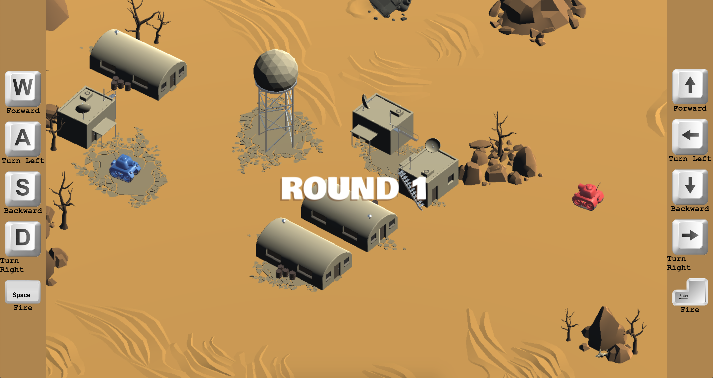

# Tanks

[View Live](https://steveninouye.github.io/tanks-game)

Tanks is a game two player game where each player drives around the map while trying to destroy the other player by firing ranged missiles. The longer a player holds their firing button before releasing it, the farther the missile will launch.

This game was built with Unity 3D and leveraged HTML5 WebGL

